**🔭 The Open Source Telescope — discover software the algorithms won't show you**

**Free forever · No ads, no tracking, no paywalls**

---

**Openlysts is a high-velocity discovery engine for open-source software.** It scans
and scores GitHub repositories around the clock, so you can find the right tool in
seconds — not after an afternoon of tabs.

**[→ Explore the live catalogue](https://www.openlysts.dpdns.org/discover)** ·
**[→ Browse alternatives](https://www.openlysts.dpdns.org/alternatives)** ·
**[→ Use free tools](https://www.openlysts.dpdns.org/toolkit)** ·
**[→ Read the blog](https://www.openlysts.dpdns.org/blog)**

## Why Openlysts exists

GitHub's trending page is a popularity contest. Search engines bury small gems under
SEO spam. **Openlysts measures what matters:**

- 🧮 **Real quality scores** — maintenance, velocity, and community signals, not just stars
- ✅ **Verified open source** — every repo license-checked before it earns a badge
- 🔁 **Living catalogue** — thousands of open-source repositories and SaaS alternatives, refreshed daily
- 🧭 **Honest discovery** — no sponsored rankings, ever. Paid slots are always labelled
- 🆓 **Free to everyone** — funded by the people who use it, not by selling your data

## What you can do here

| | |
|---|---|
| 🔭 **Discover** | A curated feed of quality open-source projects with live quality scores |
| 🔄 **Alternatives** | Find open-source replacements for any SaaS tool — every alternative is license-verified and scored |
| 🧰 **Free Toolkit** | Hundreds of free calculators and decision tools — no sign-up, no install, runs in your browser |
| 📈 **Trend Radar** | See what's genuinely accelerating — not what's merely loud |
| ⚖️ **Compare** | Side-by-side deep dives with community, license and activity graphs |
| 🔍 **Power search** | GitHub-style syntax — `language:python stars:>1000 topic:rag` |
| 📚 **Blog** | Plain-language guides on AI, agents, self-hosting and open-source intelligence |
| 📣 **Advertise** | Clearly-labelled sponsored spots and banners for your project or product |
| 🧩 **Widgets** | Embed live Openlysts quality scores and stats on your own site |

## 🧰 Free Toolkit — calculators and decision tools for everyone

Openlysts ships a free toolkit of calculators and decision tools that run entirely
in your browser — no account, no install, no tracking. Whether you are a developer
picking an open-source licence, or someone working out what a subscription really
costs, there is a tool for it.

**For developers:**
- Licence advisor — can you ship this commercially, and what must you do?
- Maintenance radar — is this project still alive, or quietly abandoned?
- Self-host readiness — could you actually run this yourself?
- Migration planner — what would replacing a paid tool actually save?
- Stack health — do the projects you picked actually fit together?

**For everyone:**
- Subscription bill calculator — add every SaaS tool you pay for and see the true cost
- Loan and mortgage calculators — monthly payment, total interest, payoff timeline
- Unit converters — temperature, data sizes, number bases, currencies
- Health and fitness tools — BMI, calorie needs, macro balance, heart rate zones
- Date and time tools — age calculator, work hours, time zones, countdown timers

Every tool explains itself, shows its working, and opens with a realistic example so
you can read an answer before you type anything.

**[→ Browse the full toolkit](https://www.openlysts.dpdns.org/toolkit)**

## 🔄 Open-source alternatives — replace paid SaaS with free software

Openlysts tracks thousands of open-source alternatives to popular SaaS products.
Every alternative is scored by code quality, community health, and feature parity —
so you can pick the right replacement with confidence.

Find free, self-hosted alternatives for design tools, project management, databases,
AI platforms, analytics, CRMs, and more — all verified and updated continuously.

**[→ Browse all alternatives](https://www.openlysts.dpdns.org/alternatives)**

## 📣 Advertise & work with us

Openlysts runs **no third-party ad networks** — the only commercial surfaces are
clearly-labelled placements that never touch rankings. Everything below starts with a
message through the [contact form](https://www.openlysts.dpdns.org/contact):

- 🌟 **Sponsored Spotlight** — put your project in the labelled top slot of the Discover
  feed, in front of developers actively searching for tools like yours
- 🖼️ **Sponsored banners** — a marked banner placement across the site, always disclosed
- 🧩 **Embeddable widgets** — show live Openlysts quality scores and stats on your own
  website, docs or README with a single snippet
- ➕ **Add your open-source project** — get it reviewed, license-verified and listed in
  the live catalogue
- 🤝 **Partnerships & feedback** — integrations, collaborations, or just telling us what
  would make Openlysts better

Paid placements are always labelled *"Paid placement — rankings are never changed"*.
That's the deal, and it always will be.

## Questions

<b>How is this different from GitHub Trending?</b>

GitHub Trending ranks by star *velocity* for a few hours. Openlysts evaluates
repositories on maintenance health, license verifiability, community engagement and
momentum — continuously, across the entire catalogue — and shows you *why* a project
is worth your time.

<b>Is Openlysts really free?</b>

Yes — free to use, no account required to browse, no ads, and no paywalled features.
It is a solo, creator-run project and it stays alive thanks to the sponsors below.

<b>Can I contribute or add my project?</b>

Absolutely. Open an issue or discussion here on GitHub, or use the
[contact form](https://www.openlysts.dpdns.org/contact) on the site. Projects are reviewed
and added to the live catalogue.

<b>Repo owner? Sponsor your project for the top spot on the Discover page</b>

**Any repo owner or sponsor can feature their project in the labelled Sponsored
Spotlight slot at the top of the Discover feed.** It's a premium, clearly marked
placement (badge + spotlight card with a "Paid placement — rankings are never
changed" disclosure) that puts your project in front of thousands of developers
looking for exactly what you build. Reach out through the
[contact form](https://www.openlysts.dpdns.org/contact) to talk placement — we keep
pricing simple and the listing honest.

<b>Where does the data come from?</b>

The catalogue is assembled from the public GitHub API, awesome-lists and curated
directories, then enriched and license-verified by our pipeline. Sources and
verification badges are shown on every entry.

<b>Something isn't loading / looks wrong on the site?</b>

Head to the [contact page](https://www.openlysts.dpdns.org/contact) and tell us what you
saw — device, browser, and what you were doing. If the site feels slow, refresh once:
a stale app-shell cache is the usual culprit, and the fix is a normal reload.

## ❤️ Keep Openlysts alive

Openlysts is free to use and **always will be**. It's built in the open by a solo
creator who believes great software should be findable by everyone.

But behind every "free" there are **real bills** — the database, the hosting, the
domain, and the APIs that keep the catalogue fresh. If Openlysts saves you time,
helps you choose well, or simply makes you smile, any support is deeply appreciated:

**[❤️ Sponsor on GitHub](https://github.com/sponsors/openlysts)** · **[☕ Support on Ko-fi](https://ko-fi.com/buymegoodcoffee)** · **[💳 PayPal](https://paypal.me/buymegoodcoffee/sponsor)**

Every contribution goes straight to keeping this project running, and every sponsor
gets a warm place in the Openlysts community. **Building open source yourself?**
[Feature your project in the Sponsored Spotlight](https://www.openlysts.dpdns.org/contact)
and get it in front of the whole Openlysts audience. Thank you for being here. 🙏

---

**Openlysts is operated as a hosted service.** © 2026 Openlysts — a proprietary, closed-source product (see [LICENSE](LICENSE)). See [SECURITY.md](SECURITY.md) to report a vulnerability.

