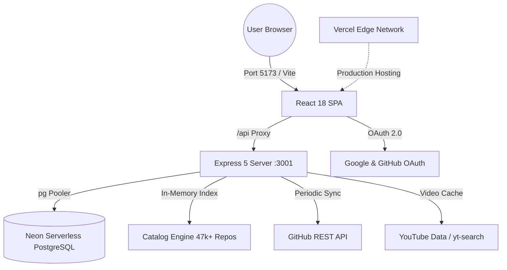

# 📚 Openlysts — Master Skills, Resources & Ecosystem Index

A comprehensive, categorized guide to all **AI Agent Skills**, **Design Libraries**, **Animation Engines**, **Cloud Infrastructure**, and **Core Technologies** utilized across Openlysts.

---

## 📑 Table of Contents

1. [🎨 Visual, UI & Design Engineering Skills](#1--visual-ui--design-engineering-skills)
2. [📐 Emil Kowalski Motion & Micro-Interaction Suite](#2--emil-kowalski-motion--micro-interaction-suite)
3. [⚙️ Backend, QA & Architecture Skills](#3--backend-qa--architecture-skills)
4. [🔌 IDE Plugins & System Extensions](#4--ide-plugins--system-extensions)
5. [🌐 Cloud Infrastructure, APIs & Data Services](#5--cloud-infrastructure-apis--data-services)
6. [📦 Full-Stack Technology & Dependency Matrix](#6--full-stack-technology--dependency-matrix)
7. [🛡️ Zero-Leak & Offline Resilience Architecture](#7--zero-leak--offline-resilience-architecture)

---

## 1. 🎨 Visual, UI & Design Engineering Skills

Specialized toolkits for crafting animations, WebGL canvas shaders, anti-slop interfaces, and design quality enforcement.

### 🌟 [react-bits](file:///d:/AI/Openlyst/openlyst/.agents/skills/react-bits/SKILL.md)
- **Official Source**: [React Bits (reactbits.dev)](https://reactbits.dev/) | [GitHub: DavidHDev/react-bits](https://github.com/DavidHDev/react-bits)
- **Location**: `.agents/skills/react-bits/`
- **What It Provides**: 165+ production-ready animated components (blur text reveal, particle fields, magnetic buttons, spotlight cards, animated digit counters).
- **When to Use**: When creating hero banners, stat tickers (`AnimateDigits.jsx`), morphing hover cards (`SocialHoverCards.jsx`), and interactive typography.

---

### 🌌 [uiverse-galaxy](file:///d:/AI/Openlyst/openlyst/.agents/skills/uiverse-galaxy/SKILL.md)
- **Official Source**: [Uiverse.io](https://uiverse.io/) | [GitHub: uiverse-io/galaxy](https://github.com/uiverse-io/galaxy)
- **Location**: `.agents/skills/uiverse-galaxy/`
- **What It Provides**: 3,000+ open-source CSS/Tailwind UI elements (neomorphic buttons, cyber-glow cards, orbital loaders, toggle switches, floating inputs).
- **When to Use**: When sourcing rapid micro-components and converting raw CSS into accessible, dark-themed Openlysts React primitives (`#09090b` / `#18181b`).

---

### 🔮 [shaders-effects](file:///d:/AI/Openlyst/openlyst/.agents/skills/shaders-effects/SKILL.md)
- **Official Source**: [Shaders.com](https://shaders.com/) & WebGL / GLSL Pipelines
- **Location**: `.agents/skills/shaders-effects/`
- **What It Provides**: Custom GLSL fragment/vertex shader recipes (liquid metal, cursor-reactive noise distortion, particle vector swarms, chromatic aberration, iridescent glass).
- **When to Use**: When building immersive canvas visuals with strict GPU memory cleanup (`THREE.ShaderMaterial` dispose lifecycle).

---

### 🪐 [threejs-backgrounds](file:///d:/AI/Openlyst/openlyst/.agents/skills/threejs-backgrounds/SKILL.md)
- **Official Source**: Openlysts Custom WebGL Engine
- **Location**: `.agents/skills/threejs-backgrounds/` & [`src/components/openlyst/ThreeBackground.jsx`](file:///d:/AI/Openlyst/openlyst/src/components/openlyst/ThreeBackground.jsx)
- **What It Provides**: Zero-memory-leak Three.js runtime managing 10+ dynamic 3D scenes (Particle Wave, Cyber Grid, Starfield, Floating Orbs, Blackhole).
- **When to Use**: When adding or customizing background themes in `Settings.jsx` while enforcing 1-draw-call buffer geometry and garbage-collection safety.

---

### ✨ [impeccable](file:///d:/AI/Openlyst/openlyst/.agents/skills/impeccable/SKILL.md)
- **Official Source**: [Impeccable Design (impeccable.style)](https://impeccable.style/) | [Paul Bakaus](https://github.com/pbakaus/impeccable)
- **Location**: `.agents/skills/impeccable/`
- **What It Provides**: 59 deterministic detector rules that catch AI-generated slop (overused violet gradients, bad contrast, flat hierarchy, tiny hit targets, layout-thrashing transitions).
- **When to Use**: During UI audits or before major visual releases (`npx impeccable detect src/`).

---

### 💎 [design-taste-frontend](file:///d:/AI/Openlyst/openlyst/.agents/skills/design-taste-frontend/SKILL.md) & [`design-md`](file:///d:/AI/Openlyst/openlyst/.agents/skills/design-md/SKILL.md)
- **Official Source**: Openlysts Design System Standard
- **Location**: `.agents/skills/design-taste-frontend/` & `.agents/skills/design-md/`
- **What It Provides**: Handcrafted typography rules, bespoke zinc/emerald/cyan/violet color tokens, elevation scales, and strict anti-template guidelines.
- **When to Use**: Baseline reference for all layout, spacing, button, and card implementations.

---

## 2. 📐 Emil Kowalski Motion & Micro-Interaction Suite

An elite design engineering curriculum and tooling pack by [Emil Kowalski](https://github.com/emilkowalski/skill) encoding fluid motion, spring physics, and Apple-grade interface polish.

| Skill | Purpose & Capabilities | Primary Use Case |
| :--- | :--- | :--- |
| **[`emil-design-eng`](file:///d:/AI/Openlyst/openlyst/.agents/skills/emil-design-eng/SKILL.md)** | Core philosophy on invisible UI polish, click feedback, and spatial consistency. | Guiding component UX decisions and tactile interface feedback. |
| **[`animate`](file:///d:/AI/Openlyst/openlyst/.agents/skills/animate/SKILL.md)** | Builds web animations from scratch with precise spring physics, durations, and exit states. | Modal entrances, expanding accordion cards, and layout morphs. |
| **[`animate-expo`](file:///d:/AI/Openlyst/openlyst/.agents/skills/animate-expo/SKILL.md)** | React Native / Expo motion with Reanimated, gesture handlers, and haptic integration. | Mobile-specific interactive sheets, gestures, and tactile vibrations. |
| **[`animation-vocabulary`](file:///d:/AI/Openlyst/openlyst/.agents/skills/animation-vocabulary/SKILL.md)**| Reverse-lookup motion glossary ("rubber-banding", "pop-in", "stagger reveal"). | Translating descriptive user prompts into exact animation curves. |
| **[`apple-design`](file:///d:/AI/Openlyst/openlyst/.agents/skills/apple-design/SKILL.md)** | Apple's fluid design language: momentum scrolling, translucent materials, optical sizing. | macOS/iOS-style blur surfaces, spring-back drawers, and sheets. |
| **[`ask-sonner`](file:///d:/AI/Openlyst/openlyst/.agents/skills/ask-sonner/SKILL.md)** | Definitive manual for [Sonner](https://sonner.emilkowal.ski/) toast notifications. | Success/error feedback, async promise toasts, and dark-theme alerts. |
| **[`find-animation-opportunities`](file:///d:/AI/Openlyst/openlyst/.agents/skills/find-animation-opportunities/SKILL.md)** | Read-only inspector discovering missing micro-interactions across components. | Auditing static screens to make them feel alive without bloat. |
| **[`improve-animations`](file:///d:/AI/Openlyst/openlyst/.agents/skills/improve-animations/SKILL.md)** | Full codebase motion survey producing prioritized optimization roadmaps. | Eliminating jank, layout shifts, and inconsistent easing curves. |
| **[`review-animations`](file:///d:/AI/Openlyst/openlyst/.agents/skills/review-animations/SKILL.md)** | Frame-by-frame animation review tool for fine-tuning duration and mass/stiffness. | Polishing pull requests and complex multi-element choreographed reveals. |
| **[`pick-ui-library`](file:///d:/AI/Openlyst/openlyst/.agents/skills/pick-ui-library/SKILL.md)** | Evaluates component library trade-offs (Radix vs. React Aria vs. Base UI vs. Ark). | Selecting the right unstyled accessible primitive for new features. |
| **[`prototype`](file:///d:/AI/Openlyst/openlyst/.agents/skills/prototype/SKILL.md)** | Rapid prototyping techniques for interactive UI experiments. | Validating new interaction concepts before full backend wiring. |
| **[`write-swift`](file:///d:/AI/Openlyst/openlyst/.agents/skills/write-swift/SKILL.md)** | Modern Swift 6 concurrency, value types, actor isolation, and API design. | Native iOS/macOS integration or companion apps. |

---

## 3. ⚙️ Backend, QA & Architecture Skills

Mission-critical engineering workflows ensuring zero-mock data integrity, automated testing, and multi-branch release safety.

### 🧪 [openlyst-qa-tester](file:///d:/AI/Openlyst/openlyst/.agents/skills/openlyst-qa-tester/SKILL.md)
- **Role**: Playwright MCP Physical Browser Testing Matrix.
- **Capabilities**: Executes sequential test cases (`TC-001` through `TC-N`) covering real UI rendering, live API responses, Neon PostgreSQL persistence, responsive mobile viewports, keyboard a11y, and security audits.
- **Trigger**: Full E2E audit, pre-deployment signoff.

### 🔌 [backend-api-integration](file:///d:/AI/Openlyst/openlyst/.agents/skills/backend-api-integration/SKILL.md)
- **Role**: Zero-Mock Backend API Standards.
- **Capabilities**: Enforces real-world Express 5 routes, parameterized SQL queries via `pg` pool, robust error envelopes, and seamless integration with `src/api/localClient.js`.

### 🚀 [git-release-workflow](file:///d:/AI/Openlyst/openlyst/.agents/skills/git-release-workflow/SKILL.md)
- **Role**: Production Branch Sync & Vercel Release Protocol.
- **Capabilities**: Standard Operating Procedure (SOP) for staging changes, resolving lock files, syncing `experimental` → `dev` → `main` → `backup`, and triggering forced Vercel deployments strictly from `main`.

### 📁 [manual-folder-integration](file:///d:/AI/Openlyst/openlyst/.agents/skills/manual-folder-integration/SKILL.md)
- **Role**: Clean UI Component Wiring.
- **Capabilities**: Guidelines for integrating new views or component folders into the routing table without polluting state or introducing mock fallbacks.

---

## 4. 🔌 IDE Plugins & System Extensions

Pre-installed global customization packages extending the agent's inspection, analysis, and debugging capabilities.

| Plugin Name | Exposed Skills & Tools | Purpose |
| :--- | :--- | :--- |
| **`chrome-devtools-plugin`** | `chrome-devtools`, `a11y-debugging`, `debug-optimize-lcp`, `memory-leak-debugging`, `troubleshooting` | Browser DOM profiling, memory snapshot leak detection, Core Web Vitals (LCP/INP) optimization. |
| **`modern-web-guidance-plugin`** | `modern-web-guidance`, `chrome-extensions` | Modern web standards, View Transitions API, container queries, `:has()` selectors, Manifest V3 extensions. |
| **`gemini-api`** | `gemini-interactions-api`, `gemini-live-api-dev` | Multimodal generation, structured JSON tool calling, and real-time bidirectional WebSocket streaming. |
| **`google-antigravity-sdk`** | `google-antigravity-sdk` | Agent lifecycle hooks, subagent spawning, and IDE environment configuration. |
| **`data-agent-kit-plugin`** | `accidental-data-loss-prevention`, `bigquery-sql`, `data-autocleaning`, `dataform-bigquery`, `dbt-bigquery` | Database safeguard protocols, ETL pipeline generation, and SQL tuning. |
| **`playwright` MCP Server** | Native browser navigation, snapshotting, screenshot capture, clicking, typing, and network inspection. | Automated, non-headless physical UI verification directly in the local browser. |

---

## 5. 🌐 Cloud Infrastructure, APIs & Data Services

External platforms and live services powering Openlysts' data ingestion, search, and user accounts.



| Service | Endpoint / Reference | Functionality in Openlysts |
| :--- | :--- | :--- |
| **Neon PostgreSQL** | [ep-old-dawn-ayka1gvh-pooler](https://neon.tech/) | Primary relational database storing `Repository`, `Alternative`, `User`, `session`, and `AuditLog` records. |
| **Vercel** | [openlysts.vercel.app](https://openlysts.vercel.app/) | Global CDN edge network, production deployment pipelines, and serverless backend routing. |
| **GitHub REST API** | `api.github.com` | Automated ingestion of stars, velocity, issues, release frequency, topics, and licensing data. |
| **YouTube Data / yt-search** | `npm: yt-search` | Automated matching and caching of repository educational video tutorials and reviews. |
| **Google Cloud Console** | Google Identity OAuth 2.0 | Social single sign-on and email verification. |
| **GitHub Developer Portal** | GitHub OAuth App | Developer authentication and repository link association. |

---

## 6. 📦 Full-Stack Technology & Dependency Matrix

The audited software package inventory configured in [`package.json`](file:///d:/AI/Openlyst/openlyst/package.json):

```
Openlysts Architecture
 ├── Frontend Layer (React 18 + Vite 6)
 │    ├── UI & Components: @radix-ui/*, lucide-react, embla-carousel-react, vaul, cmdk
 │    ├── Motion & 3D: framer-motion, three, ogl, canvas-confetti
 │    ├── Styling: tailwindcss, tailwindcss-animate, @tailwindcss/typography, clsx, tailwind-merge
 │    ├── Routing & Query: react-router-dom (v6), @tanstack/react-query (v5)
 │    └── Markdown & Code: react-markdown, highlight.js, rehype-highlight, rehype-raw
 │
 ├── Backend Layer (Node.js ESM + Express 5)
 │    ├── Server Core: express (v5.2), cors, dotenv, date-fns, lodash
 │    ├── Auth & Session: express-session, connect-pg-simple, bcryptjs, input-otp
 │    ├── Database: pg (PostgreSQL connection pooler), @hookform/resolvers, zod
 │    └── Ingestion & Search: cheerio, yt-search, catalogEngine.js (47k in-memory index)
 │
 └── Testing & Quality
      ├── E2E Browser Testing: @playwright/test, playwright
      └── Linting & Types: eslint, typescript (v5.8), jsconfig.json
```

---

## 7. 🛡️ Zero-Leak & Offline Resilience Architecture

Openlysts implements four core resilience layers ensuring lightning performance and zero downtime:

1. **In-Memory Catalog Engine (`server/services/catalogEngine.js`)**:
   - Indexes **47,068 repositories** and **1,867 alternatives** directly in Node.js RAM on boot.
   - Powers sub-20ms instant keyword and topic searches with zero Neon PostgreSQL database read bandwidth consumption.
2. **Client Outbox Sync Engine (`src/lib/syncOutbox.js`)**:
   - Commits bookmark toggles, profile adjustments, and feedback in **0ms** locally via `localStorage`.
   - Synchronizes changes to PostgreSQL in the background with exponential backoff retry.
3. **Resilient Session Store (`server/auth/session.js`)**:
   - Hybrid PostgreSQL (`connect-pg-simple`) + memory store ensuring users remain logged in even if the database is throttled.
4. **Persistent Video Disk Cache (`server/data/video_cache.json`)**:
   - Pre-indexes YouTube tutorial links on disk for instant modal rendering without scraping latency.
